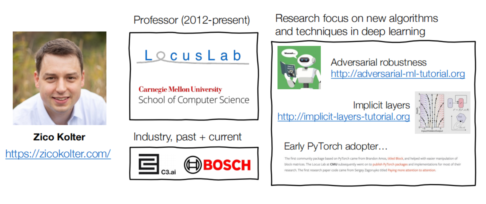

CMU Deep Learning System，教你如何实现一个深度学习系统。

[CS 自学指南课程介绍页面](https://csdiy.wiki/%E6%9C%BA%E5%99%A8%E5%AD%A6%E4%B9%A0%E7%B3%BB%E7%BB%9F/CMU10-414/) | [课程主页](https://dlsyscourse.org/lectures/)

[本节 Slides](https://dlsyscourse.org/slides/intro.pdf) | [本节课程视频](https://www.bilibili.com/video/BV1Rg4y137jH?p=2&vd_source=07d6eec55261917555a5d7fb4429cab9)

目前（2024.01.06）课程在线评测账号和课程论坛的注册时间已经结束，只剩下框架代码里的本地测试供大家调试代码。

## 目录

- [目录](#目录)
- [为什么要学习 deep learning？](#为什么要学习-deep-learning)
- [为什么要学习 dlsys？](#为什么要学习-dlsys)
- [dlsys 的组成部分](#dlsys-的组成部分)
- [课程教师](#课程教师)
- [学习目标和课程主题](#学习目标和课程主题)
- [课程前置条件](#课程前置条件)
- [课程内容](#课程内容)

## 为什么要学习 deep learning？

Deep learning 极大地拓宽了当前 AI 的应用范围，例如计算机视觉、自然语言处理、语音识别等等。
许多现实世界的非常 Amazing 的 deep learning 应用，Alexnet、AlphaGo、StyleGAN、GPT-3、AlphaFold 2、Stable Diffusion 等等。
除了这些非常大型的应用，还有很多小型的项目同样非常有趣，例如 Llama.cpp、Pytorch Image Models 还有许多其他社区驱动的项目和框架。

## 为什么要学习 dlsys？

每一次易用的 deep learning 框架的出现，都会带来一次新的 deep learning 热度的爆发，例如 TensorFlow、Pytorch、JAX 等等。

三个具体的理由：

1. 开发 dlsys
2. 更高效地利用现有系统
3. dlsys 非常有趣

## dlsys 的组成部分

- **组合**多个张量操作以构建现代机器学习模型
- 通过自动微分来**执行**一系列操作
- 通过专用硬件**加速**计算
- **扩展**更多硬件后端，更多操作符

## 课程教师

## 学习目标和课程主题

在本课程结束时，您将会…
… 理解现代深度学习库的基本功能，包括自动微分、基于梯度的优化等概念
… 能够从零开始实现几种标准的深度学习架构（MLP、ConvNets、RNNs、Transformers）
… 理解现代深度学习架构中硬件加速（例如在 GPU 上）的工作原理，并能够开发高效的自己的代码

广泛的主题包括：机器学习复习/背景知识、自动微分、全连接网络、优化、神经网络库、卷积神经网络、硬件和 GPU 加速、序列模型、训练大型模型、Transformers 和注意力机制、生成模型

## 课程前置条件

学习这门课需要了解的前置知识

1. 系统编程
2. 线性代数
3. 一些其他数学基础：微积分、概率论、基本的证明知识
4. Python 和 C++ 编程
5. Machine Learning 的基础知识

## 课程内容

这门课程将包括四个主要元素

1. 课堂讲座
2. 编程作业（个人）
3. （小组）期末项目
4. 在课程论坛中的互动/讨论

成绩分配：作业占 55%，项目占 35%，课堂参与占 10%。

目前（2024.01.06）无法进行在线公开注册，无法参与课程论坛，课程作业无法提交到在线评测系统，只能在本地调试代码。

编程作业：
该课程将包括四个基于编程的作业，另外还有一个作业 0，用于回顾/测试您的背景知识。
作业完全基于编码：在作业中，您将逐步开发一个名为 Needle 的类似于 PyTorch 的深度学习库，具有自动微分、基于梯度的模型优化、支持标准运算符（如卷积、循环结构、自注意力）以及（手动编写的）在 CPU 和 GPU 设备上高效的线性代数运算。
~~作业将使用我们为本课程开发的自定义系统进行自动评分（在下一节课中进行演示和说明）~~。

期末项目：
除了作业外，还将有一个期末项目，由 2-3 名学生组成的小组完成（仅限 2-3 人，不能是 1 人或 4 人组）。
期末项目应涉及在 Needle 中开发一个重要的新功能，或在框架中实现一些新的架构（请注意，您必须在 Needle 中实现，不能使用 PyTorch 或 TensorFlow 等其他框架进行期末项目）。
在期末项目提案/团队组建截止日期之前，我们将发布一系列可能的项目主题/想法。
