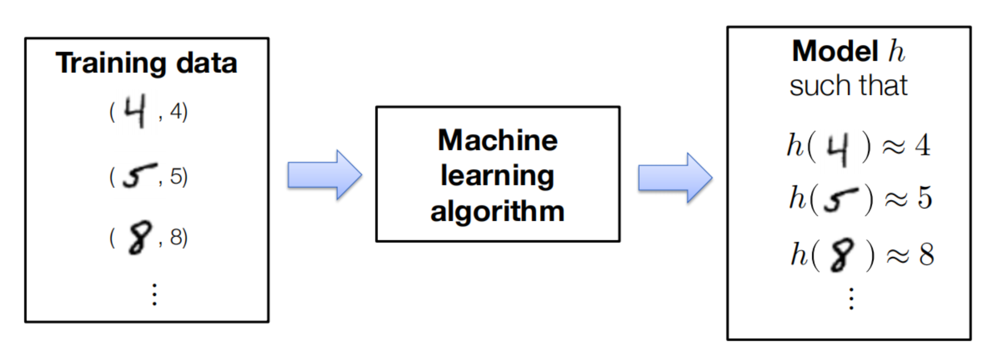
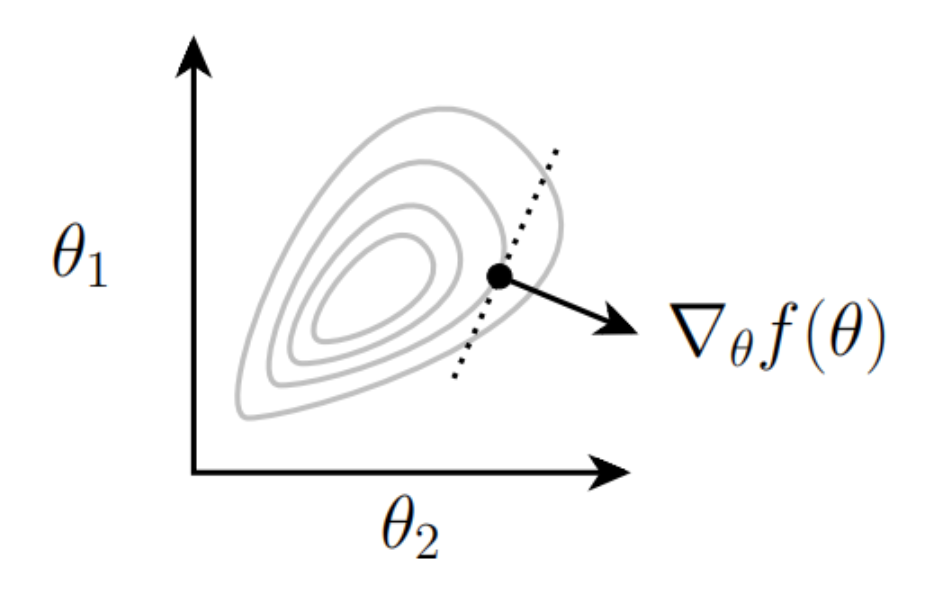
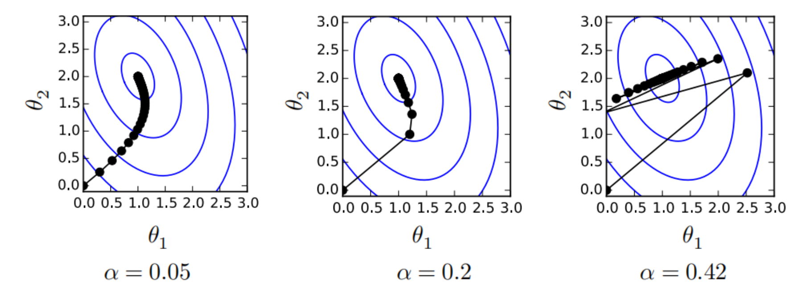

[本节 Slides](https://dlsyscourse.org/slides/softmax_regression.pdf) | [本节课程视频](https://www.bilibili.com/video/BV1Rg4y137jH?p=3&vd_source=07d6eec55261917555a5d7fb4429cab9)

这一节课是对机器学习内容的一个复习，以 Softmax Regression 为例讲解一个典型的有监督机器学习案例的整个流程以及其中的各种概念。预期读者应当对机器学习的基本概念有一定的了解。

## 目录

- [目录](#目录)
- [机器学习基础](#机器学习基础)
- [Softmax Regression 案例](#softmax-regression-案例)
  - [问题定义](#问题定义)
  - [模型假设](#模型假设)
  - [损失函数](#损失函数)
  - [优化方法](#优化方法)
  - [完整算法描述](#完整算法描述)

## 机器学习基础

针对于手写数字识别这一问题，传统的图像识别算法可能是首先找到每个数字的特征，然后手写规则来识别每个数字。这种方式的问题在于，当我们想要识别的对象的种类很多时，我们需要手动设计的规则就会变得非常复杂，而且这些规则很难设计得很好，因为我们很难找到一个完美的特征来区分所有的对象。

而机器学习方法则是让计算机自己学习如何区分这些对象，我们只需要给计算机一些数据，让它自己学习如何区分这些数据，这样的方法就可以很好地解决这个问题。

具体到有监督机器学习方法，我们需要给计算机一些数据，这些数据包含了我们想要识别的对象的一些特征，以及这些对象的标签，计算机需要从这些数据中学习到如何区分这些对象，如下图

图里中间部分即为我们需要建立的机器学习模型，通常由以下内容组成：

1. 模型假设：描述我们如何将输入（例如数字的图像）映射到输出（例如类别标签或不同类别标签的概率）的“程序结构”，通过一组参数进行参数化。
2. 损失函数：指定给定假设（即参数选择）在所关注任务上的表现“好坏”的函数。
3. 优化方法：确定一组参数（近似）最小化训练集上损失总和的过程。

## Softmax Regression 案例

### 问题定义

让我们考虑一个 k 类分类问题，其中我们有：

- 训练数据：$x^{(i)} \in \mathbb{R}^n$, $y^{(i)} \in {1,\dots, k}$ for $i = 1, … , m$
- 其中 $n$ 为输入数据的维度，$m$ 为训练数据的数量，$k$ 为分类类别的数量
- 针对 28x28 的 MNIST 数字进行分类，$n = 28 \cdot 28 = 784$, $k = 10$, $m = 60,000$

### 模型假设

我们的模型假设是一个线性模型，即

$$
h_\theta(x) = \theta^T x
$$

其中 $\theta \in \mathbb{R}^{n\times k}$ 是我们的模型参数，$x \in \mathbb{R}^n$ 是输入数据。

机器学习中，经常使用的形式是多个输入叠加在一起的形式，即

$$
X \in \mathbb{R}^{m\times n}= \begin{bmatrix} {x^{(1)}}^T \\ \vdots \\ {x^{(m)}}^T \end{bmatrix}, \quad y = \begin{bmatrix} y^{(1)} \\ \vdots \\ y^{(m)} \end{bmatrix}
$$

然后线性模型假设可以写为

$$
h_\theta(X)  = \begin{bmatrix} {x^{(1)}}^T\theta \\ \vdots \\ {x^{(m)}}^T\theta \end{bmatrix} = X\theta
$$

### 损失函数

最简单的损失函数就是根据是否预测正确，如

$$
\ell_{e r r}(h(x), y)=\left\{\begin{array}{ll}
0 & \text { if } \operatorname{argmax}_{i} h_{i}(x)=y \\
1 & \text { otherwise }
\end{array}\right.
$$

我们经常用这个函数来评价分类器的质量。但是这个函数有一个重大的缺陷是非连续，因此我们无法使用梯度下降等优化方法来优化这个函数。

取而代之，我们会用一个连续的损失函数，即交叉熵损失函数

$$
z_{i}=p(\text { label }=i)=\frac{\exp \left(h_{i}(x)\right)}{\sum_{j=1}^{k} \exp \left(h_{j}(x)\right)} \Longleftrightarrow z \equiv \operatorname{softmax}(h(x))
$$

$$
\ell_{ce}(h(x), y) = -\log p(\text { label }=y) = -h_y(x) + \log \sum_{j=1}^k \exp(h_j(x))
$$

这个损失函数是连续的，而且是凸的，因此我们可以使用梯度下降等优化方法来优化这个损失函数。

### 优化方法

我们的目标是最小化损失函数，即

$$
\min_{\theta} \frac{1}{m} \sum_{i=1}^m \ell_{ce}(h_\theta(x^{(i)}), y^{(i)})
$$

我们使用梯度下降法来优化这个损失函数，针对函数$f:\mathbb{R}^{n\times k} \rightarrow \mathbb{R}$，其梯度为

$$
\nabla_\theta f(\theta) = \begin{bmatrix} \frac{\partial f}{\partial \theta_{11}} & \dots & \frac{\partial f}{\partial \theta_{1k}} \\ \vdots & \ddots & \vdots \\ \frac{\partial f}{\partial \theta_{n1}} & \dots & \frac{\partial f}{\partial \theta_{nk}} \end{bmatrix}
$$

梯度的几何含义为函数在某一点的梯度是函数在该点上升最快的方向，如下图

我们可以使用梯度下降法来优化这个损失函数，即

$$
\theta \leftarrow \theta - \alpha \nabla_\theta f(\theta)
$$

其中 $\alpha \gt 0$ 为学习率，即每次更新的步长。学习率过大会导致无法收敛，学习率过小会导致收敛速度过慢。

我们不需要针对每个样本都计算一次梯度，而是可以使用一个 batch 的样本来计算梯度，这样可以减少计算量，同时也可以减少梯度的方差，从而加快收敛速度，这种方法被称为随机梯度下降法（Stochastic Gradient Descent, SGD）。该方法的算法描述如下

$$
\left.
\begin{array}{l}
\text { Repeat:} \\
\quad \text {  Sample a batch of data } X \in \mathbb{R}^{B\times n}, y \in \{1, \dots, k\}^B \\
\quad \text {  Update parameters } \theta \leftarrow \theta-\alpha \nabla_{\theta} \frac{1}{B} \sum_{i=1}^{B} \ell_{ce}\left(h_{\theta}\left(x^{(i)}\right), y^{(i)}\right)
\end{array}
\right.
$$

前面都是针对 SGD 的描述，但是损失函数的梯度还没有给出，我们一般使用链式法则进行计算，首先计算 softmax 函数本身的梯度

$$
\frac{\partial \ell(h, y)}{\partial h_i} = \frac{\partial}{\partial h_i} \left( -h_y + \log \sum_{j=1}^k \exp(h_j) \right) = -e_y + \frac{\exp(h_i)}{\sum_{j=1}^k \exp(h_j)}
$$

写成矩阵形式即为

$$
\nabla_h \ell(h, y) = -e_y + \operatorname{softmax}(h)
$$

然后计算损失函数对模型参数的梯度

$$
\frac{\partial \ell(h, y)}{\partial \theta} = \frac{\partial \ell(\theta^T x, y)}{\partial \theta} = \frac{\partial \ell(h, y)}{\partial h} \frac{\partial h}{\partial \theta} = x(\operatorname{softmax}(h) - e_y)^T
$$

写成矩阵形式即为

$$
\nabla_\theta \ell(h, y) = X^T (\operatorname{softmax}(X\theta) - \mathbb{I}_y)
$$

### 完整算法描述

最终算法描述为

$$
\left.
\begin{array}{l}
\text { Repeat:} \\
\quad \text {  Sample a batch of data } X \in \mathbb{R}^{B\times n}, y \in \{1, \dots, k\}^B \\
\quad \text {  Update parameters } \theta \leftarrow \theta-\alpha X^T (\operatorname{softmax}(X\theta) - \mathbb{I}_y)
\end{array}
\right.
$$

以上就是完整的 Softmax Regression 的算法描述，最终在 hw0 中我们会实现这个算法，其分类错误率将低于 8 %。
